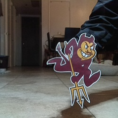
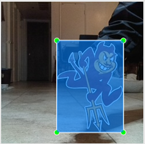
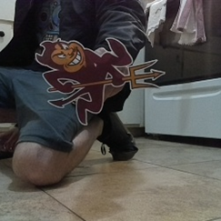
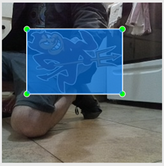
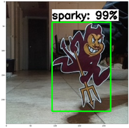
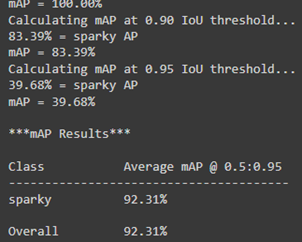
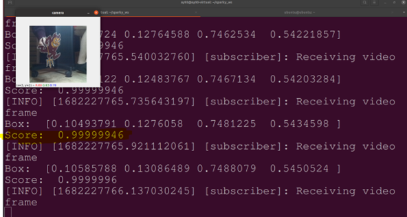
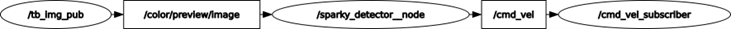
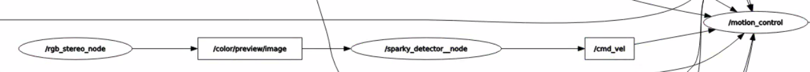

# EGR-598-Robot-Deployment-Team-2 Repo
### This mark down serves as the Final Report deliverable


## Project Description & Goals

The current project progress has been in accordance with the previously set goals. The team has gathered the required data and utilized it to train a deep neural network model. Specifically, a single shot detection mobilenet (SSD-mobilenet) model has been employed, which leverages input images to compute an output bounding box and generate appropriate object classes. The SSD-mobilenet model comprises two deep neural networks that have been specifically designed for image detection and classification.

Following the training phase, our model can currently detect Sparky in an image after being trained with a dataset of 150 images depicting Sparky in various positions. Some of these images were also employed for validation and testing purposes. The subsequent objective is to integrate the trained data with the Turtlebot platform. To accomplish this, we are utilizing our previous OpenCV assignment as a reference on how to subscribe to the ROS2 (Robot Operating System) topic of the Oak-D camera, and how to publish wheel commands to the Turtlebot depending on whether Sparky is present in the frame or not.

After the implementation, the team spent a day testing and tuning the model before performing a live demo on April 26th. As a result of these efforts, the team has been able to achieve its objectives, namely, having the Turtlebot rotate continuously while searching for Sparky. We have successfully trained the model to recognize Sparky and respond by halting the Turtlebot whenever Sparky appears in the frame.

## Project Progress

The following gantt chart illustrates the goals that the team has set according to deadlines as to when it is anticipated we would complete them. As demonstrated, the team was able to successfully stay on track and have the deliverables ready on their due dates.

| Tasks & April’s dates | 15 | 16 | 17 | 18 | 19 | 20 | 21 | 22 | 23 | 24 | 25 | 26 | - | 3 |
| --- | --- | --- | --- | --- | --- | --- | --- | --- | --- | --- | --- | --- | --- | --- |
| Collect Data |X|
| Build & Train Model ||X|X|X|X|X|
| Integrate Model to TB |||||||X|X|X|X|
| Test & Tune Model  |||||||||||X|
| Present Live Model ||||||||||||X|
| Final Report |||||||||||||X|X|

## Data Collection Progress

Our team made the needed progress of collecting the required data for the project. In an effort to streamline the data collection process, we decided to utilize images captured by the TurtleBot's Oak-D camera as our primary dataset. The deep neural network model that we are employing, namely ssd-mobilene, employs a single shot for object detection. To train the model effectively, it was necessary to collect multiple images of Sparky and label them appropriately. Initially, we captured around 250 pictures, but we encountered some issues with lighting conditions. Consequently, we decided to use only 150 pictures for training the model, which would also expedite the deep learning process, albeit at the cost of reduced accuracy. To facilitate the labeling process, we utilized an open-source image labeling program called LabelImg. This application enabled us to define the four points of a bounding box around Sparky in each image and assign a custom label to it. For our purposes, we simply used the label "sparky". This approach allowed us to effectively tag and classify the images, thereby enabling the deep neural network model to learn and improve its object detection capabilities.

## Data Examples



Raw Image from Oak-D camera



Image bound defined in LabelImg

Output .xml file after tagging:
```
<annotation>
	<folder>sparky_data_set</folder>
	<filename>frame0.png</filename>
	<path>/home/ay93/sparky_ws/sparky_data_set/frame0.png</path>
	<source>
		<database>Unknown</database>
	</source>
	<size>
		<width>250</width>
		<height>250</height>
		<depth>3</depth>
	</size>
	<segmented>0</segmented>
	<object>
		<name>sparky</name>
		<pose>Unspecified</pose>
		<truncated>0</truncated>
		<difficult>0</difficult>
		<bndbox>
			<xmin>98</xmin>
			<ymin>69</ymin>
			<xmax>215</xmax>
			<ymax>231</ymax>
		</bndbox>
	</object>
</annotation>
```


Another Raw Image from Oak-D camera



Another Image bound defined in LabelImg

Output .xml file after tagging:
```
<annotation>
	<folder>sparky_data_set</folder>
	<filename>frame2 (2).png</filename>
	<path>/home/ay93/sparky_ws/sparky_data_set/frame2 (2).png</path>
	<source>
		<database>Unknown</database>
	</source>
	<size>
		<width>250</width>
		<height>250</height>
		<depth>3</depth>
	</size>
	<segmented>0</segmented>
	<object>
		<name>sparky</name>
		<pose>Unspecified</pose>
		<truncated>0</truncated>
		<difficult>0</difficult>
		<bndbox>
			<xmin>39</xmin>
			<ymin>42</ymin>
			<xmax>188</xmax>
			<ymax>143</ymax>
		</bndbox>
	</object>
</annotation>
```

## Deep Learning Model

The deep learning model used in this project comprises two neural networks, namely SSD-mobilenet. These neural networks have been specifically designed for processing images from single frames and leveraging them for image recognition. To train the model, we utilized the images captured during the data collection process and trained it to recognize the distinctive patterns that constitute Sparky. In order to achieve high accuracy in the object detection process, we included images containing various objects positioned behind Sparky. For instance, some images contained other red objects around Sparky to enable the model to avoid confusion with objects of the same color. Overall, the training process took approximately 45 minutes to complete. The model utilizes Tensorflow and Googlecolab as the integrated development environment (IDE). The detailed steps followed for the training process can be found in this [GoogleColab](https://colab.research.google.com/github/EdjeElectronics/TensorFlow-Lite-Object-Detection-on-Android-and-Raspberry-Pi/blob/master/Train_TFLite2_Object_Detction_Model.ipynb) document, which outlines the process of training the model to recognize and classify your own custom dataset effectively.

## Validation

The shared GoogleColab document came with an integrated two-part tester code script which tests the accuracy of the model. First it tests a batch of the image data set and outputs a bounding box with the score included, as seen in Figure 8. The second part of the test is conducted by measuring the "mean average precision" (mAP) score. The calculated mAP score came out to be 92.31%. The additional way we were able to deem the training a success, was by the systems accurate recognition of Sparky. This validation was monitored through our ROS-Python code script. Our code script, named “sparky_node” prints the percentage that the trained model outputs as it is trying to determine if an image of sparky is inside the frame.Figure 10 depicts the expected behavior by printing out a 99% rating when a Sparky is visible in the camera’s frame.



Output test result



Snippet of mAP test result



Validation screenshot with video feed and score terminal output

## ROS Architecture

Our ROS architecture is pretty straightforward and very user friendly. First a connected Turtebot4 with a camera publishing to the /color/preview/image topic. Our sparky node acts as both a topic subscriber and a topic publisher. It subscribes to the /color/image/preview topic in order to receive the video feed originating from the mounted camera. The frames are then processed through the implementation of the trained tensorflow model in the script code contained in the sparky node. This is done to evaluate the incoming frames and determine the percentage score for sparky's detection. As the code runs, it also prints the percentage score live as the video frames are fed through the trained model. Lastly, the sparky node constantly publishes to the cmd_vel topic in the form of an angular-z command to the turieltbot’s wheel. We implemented the logic to continuously rotate until the score is higher than 90%, which then stops rotating to keep the detected sparky in frame. 



Simplified ROS architecture captured and displayed by rqt_graph 



Actual ROS architecture snippet captured and displayed by rqt_graph 

## Trade-offs

In common with other teams, our team was required to make difficult tradeoffs during the course of this project. One such tradeoff involved balancing the competing objectives of accuracy and speed in relation to the training session of the deep neural network. We encountered a significant challenge in this regard, as we were utilizing an unpaid version of GoogleColab. Specifically, we were confronted with the issue of time-out when trying to complete the initial larger sample, which was anticipated to take over 5 hours to process. To mitigate this issue, we made the decision to reduce the sample size, which was necessary to reduce the total time needed to train the predictive model. The repercussions of this decision soon became apparent when false positives were detected during the object detection process. Notably, if an object was located close to a red object and had a shape that was similar to Sparky, it would be assigned a false positive score. In certain instances, these false positive scores were as high as 90%, which illustrates the negative impact of the tradeoff we made between accuracy and speed. Despite the challenges we faced, our team persevered and managed to strike an effective balance between competing objectives in this project. Our experience demonstrates the importance of being able to navigate such tradeoffs effectively, as they are often necessary to achieve project goals within specific resource constraints.

## Task Completion Videos

[](http://www.youtube.com/watch?v=DDGkr8f-Y0k)

Complete Walktrhough of Implementation with troubleshooting 

[](http://www.youtube.com/watch?v=qVNyMxsM1-8)

Short Video Showing a live demo

[](http://www.youtube.com/watch?v=8MxrQtono7k)

Short Screen recorded video showing detection via Score in terminal output

## Elevetor Pitch Video

[](http://www.youtube.com/watch?v=BUFrLVLLxyA)
